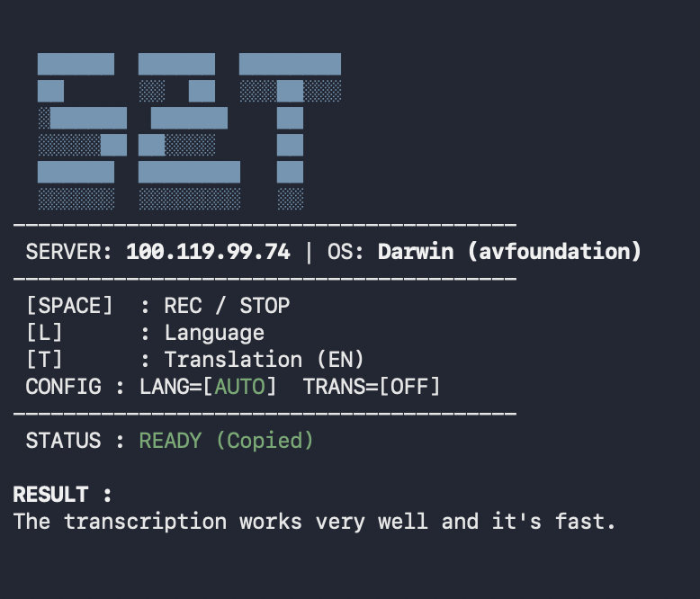

# DGX Spark Commands & Local Vibe-Coding Setup

This guide details the environment setup and execution for local inference on the NVIDIA DGX Spark, specifically optimized for "Vibe-Coding."

> **Reference:** [NVIDIA Spark Nemotron Instructions](https://build.nvidia.com/spark/nemotron/instructions)

---

## 1. Environment Verification (Single User)

### Check Toolchain Versions
Verify installed versions:

```bash
git --version
cmake --version
nvcc --version

```

### Install or Update `uv`
Manage Python environments with [uv](https://docs.astral.sh/uv/):

```bash
# Install
curl -LsSf https://astral.sh/uv/install.sh | sh

# Update
uv self update
```

### Sync and Verify Environment
```bash
uv sync
source .venv/bin/activate
hf version
```

---

## 2. Building llama.cpp with CUDA Support

Targeting DGX Spark architecture (`sm_121`).
*See [llama.cpp build docs](https://github.com/ggml-org/llama.cpp/blob/master/docs/build.md) for details.*

```bash
git clone https://github.com/ggml-org/llama.cpp
cd llama.cpp
mkdir build && cd build

# Configure for CUDA architectures 121
cmake .. -DGGML_CUDA=ON -DCMAKE_CUDA_ARCHITECTURES="121" -DLLAMA_CURL=OFF
make -j

```

---

## 3. Model Downloads

We recommend **Unsloth GGUF quants** for best performance.

### Recommended: GLM-4.7-Flash (UD-Q8_K_XL)

```bash
hf download unsloth/GLM-4.7-Flash-GGUF \
    GLM-4.7-Flash-UD-Q8_K_XL.gguf \
    --local-dir ~/models/GLM-4.7-Flash-UD-Q8_K_XL
```

*Or BF16 version:* 
```bash
hf download unsloth/GLM-4.7-Flash-GGUF \
    --include "BF16/GLM-4.7-Flash-BF16-*.gguf" \
    --local-dir ~/models/GLM-4.7-Flash-BF16
```

### Other Models

**Devstral-2-123B-Instruct (UD-Q4_K_XL):**
```bash
hf download unsloth/Devstral-2-123B-Instruct-2512-GGUF \
    --include "UD-Q4_K_XL/Devstral-2-123B-Instruct-2512-UD-Q4_K_XL-*.gguf" \
    --local-dir ~/models/Devstral-2-123B-Instruct-2512-UD-Q4_K_XL
```

**Devstral-Small-2-24B-Instruct (UD-Q8_K_XL / BF16):**
```bash
hf download unsloth/Devstral-Small-2-24B-Instruct-2512-GGUF \
    Devstral-Small-2-24B-Instruct-2512-UD-Q8_K_XL.gguf \
    --local-dir ~/models/Devstral-Small-2-24B-Instruct-UD-Q8_K_XL

hf download unsloth/Devstral-Small-2-24B-Instruct-2512-GGUF \
    Devstral-Small-2-24B-Instruct-2512-BF16.gguf \
    --local-dir ~/models/Devstral-Small-2-24B-Instruct-2512-BF16
```

**Nemotron-3-Nano-30B-A3B (UD-Q8_K_XL):**
```bash
hf download unsloth/Nemotron-3-Nano-30B-A3B-GGUF \
    Nemotron-3-Nano-30B-A3B-UD-Q8_K_XL.gguf \
    --local-dir ~/models/Nemotron-3-Nano-30B-A3B-UD-Q8_K_XL
```

**GPT-OSS-120B (F16):**
```bash
hf download unsloth/gpt-oss-120b-GGUF \
    gpt-oss-120b-F16.gguf \
    --local-dir ~/models/gpt-oss-120b-F16
```

---

## 4. Running GLM Inference Server

### Launch GLM-4.7-Flash (UD-Q8_K_XL) from root dir

```bash
screen -dmS glm-47 ./llama.cpp/build/bin/llama-server \
    --model ~/models/GLM-4.7-Flash/GLM-4.7-Flash-UD-Q8_K_XL.gguf \
    --alias "GLM-4.7-Flash-Q8_K_XL" \
    --fit on \
    --temp 1.0 \
    --top-p 0.95 \
    --min-p 0.01 \
    --port 8080 \
    --host 0.0.0.0 \
    --threads -8 \
    --jinja \
    --kv-unified \
    --cache-type-k q8_0 --cache-type-v q8_0 \
    --flash-attn on \
    --batch-size 4096 --ubatch-size 1024 \
    --ctx-size 0
```

#### or

```bash
screen -dmS glm47 bash launch_glm4.7_flash.sh
```

*Max context window: 202752*
[Documentation](https://unsloth.ai/docs/models/glm-4.7-flash)
[Documentation 2](https://unsloth.ai/docs/basics/claude-codex#start-the-llama-server)

### Launch Devstral-Small-2-24B-Instruct

```bash
screen -dmS devstral ./llama.cpp/build/bin/llama-server \
    --model ~/models/Devstral-Small-2-24B-Instruct/Devstral-Small-2-24B-Instruct-2512-UD-Q8_K_XL.gguf \
    --threads -2 \
    --ctx-size 65536 \
    --n-gpu-layers 99 \
    --seed 3407 \
    --prio 2 \
    --temp 0.15 \
    --jinja \
    --port 8080 \
    --host 0.0.0.0
```

*Note: Dense model, slower than MoE alternatives.*
[Documentation](https://unsloth.ai/docs/models/tutorials/devstral-2)

### Launch Nemotron-3-Nano-30B-A3B

```bash
screen -dmS nemotron ./llama.cpp/build/bin/llama-server \
    --model ~/models/Nemotron-3-Nano-30B-A3B/Nemotron-3-Nano-30B-A3B-UD-Q8_K_XL.gguf \
    --threads -8 \
    --ctx-size 262144 \
    --n-gpu-layers 99 \
    --jinja \
    --fit on \
    --temp 0.6 \
    --top-p 0.95 \
    --port 8080 \
    --host 0.0.0.0
```

*Tool calling: `--temp 0.6 --top-p 0.95`, Context: 262144 or 1M*
[Documentation](https://unsloth.ai/docs/models/nemotron-3)

### Launch GPT-OSS-120B (F16)

```bash
screen -dmS gptoss ./llama.cpp/build/bin/llama-server \
    --model ~/models/gpt-oss-120b/gpt-oss-120b-F16.gguf \
    --host 0.0.0.0 \
    --port 8080 \
    --n-gpu-layers 99 \
    --ctx-size 0 \
    --threads 8 \
    --jinja \
    -ub 2048 \
    -b 2048 \
    --chat-template-kwargs '{"reasoning_effort": "high"}' \
    --temp 1.0 \
    --top-p 1.0 \
    --min-p 0.0 \
    --top-k 0.0
```

[Documentation](https://unsloth.ai/docs/models/gpt-oss-how-to-run-and-fine-tune#run-gpt-oss-120b)

### Screen Commands

**Attach to screen:**
```bash
screen -r glm-47      # GLM-4.7-Flash
screen -r devstral    # Devstral-Small-2-24B
screen -r nemotron    # Nemotron-3-Nano-30B
screen -r gptoss      # GPT-OSS-120B
```

**Detach from screen:** `Ctrl+A` then `D`

**List all screens:** `screen -ls`

### Access & Utilities

- **Port change:** Update `--port` (default: 8080)
- **Web UI:** `http://localhost:8080`
- **Benchmark:** ~42 tokens/sec (GLM-4.7-Flash Q8)

---

## 5. Running Whisper Server & Transcription

See [SETUP_WHISPER.md](SETUP_WHISPER.md) for detailed instructions.

---

## 6. Whisper TUI: Voice-to-Text Terminal Interface

<figure>

<figcaption>Whisper TUI Interface</figcaption>
</figure>

**Unlock the ultimate workflow.**

👉 **[Setup Guide & Usage (TUI)](SETUP_SPEECH_TO_TEXT_TUI.md)**

---

## 7. Vibe-Coding with Mistral Vibe

### 1. Setup Workspace

```bash
mkdir vibe_coding_with_mistral_vibe
cd vibe_coding_with_mistral_vibe
```

### 2. Install Mistral Vibe CLI

Refer to the [official release](https://mistral.ai/news/devstral-2-vibe-cli):

```bash
uv tool install mistral-vibe
```

### 3. Update Mistral Vibe CLI

```bash
uv tool upgrade mistral-vibe
```

### 4. Configuration

Launch `vibe`, choose your theme, leave API key blank or whitespace (handled locally).

Edit `~/.vibe/config.toml` and add:

```toml
[[providers]]
name = "llamacpp"
api_base = "http://127.0.0.1:8080/v1"
api_key_env_var = ""
api_style = "openai"
backend = "generic"
reasoning_field_name = "reasoning_content"

[[models]]
name = "GLM-4.7-Flash-Q8_K_XL"
provider = "llamacpp"
temperature = 1.0
input_price = 0.0
output_price = 0.0

[[models]]
name = "Nemotron-3-Nano-30B-A3B"
provider = "llamacpp"
temperature = 0.6
input_price = 0.0
output_price = 0.0

```

### 5. Activation

1. Run `/reload` in the `vibe` interface
2. Type `/model`, select your model with Enter
3. Hit ESC when finished

---

## 8. Remote Vibe-Coding (Multi-Device Setup)

Run `vibe` CLI on different machines using DGX Spark's GPU.

### Prerequisites

1. **Tailscale:** Both DGX Spark and local machine on same [Tailscale](https://build.nvidia.com/spark/tailscale) network
2. **Host Binding:** Ensure `llama-server` uses `--host 0.0.0.0`

### Local Machine Configuration

Edit `~/.vibe/config.toml` on remote machine:

```toml
[[providers]]
name = "dgx-remote-llamacpp"
api_base = "http://100.114.54.60:8080/v1"  # Replace with DGX Tailscale IP
api_key_env_var = ""
api_style = "openai"
backend = "generic"

[[models]]
name = "GLM-4.7-Flash-Q8_K_XL"
provider = "dgx-remote-llamacpp"
temperature = 1.0
input_price = 0.0
output_price = 0.0

[[models]]
name = "Nemotron-3-Nano-30B-A3B"
provider = "dgx-remote-llamacpp"
temperature = 0.6
input_price = 0.0
output_price = 0.0

```

### Usage on Remote Machine

1. Run `vibe` locally
2. Execute `/reload`
3. Select remote model with `/model`

---

## 9. Quick Start Commands

### Start Everything in Background

```bash
# GLM-4.7-Flash server
screen -dmS glm47
./launch_glm4.7_flash.sh

# Whisper server
screen -dmS whisper-server
./start_whisper_server.sh

# Gradio app (new terminal)
uv run python whisper_app.py
```

### Stop Everything

Find screen names:
```bash
screen -ls
```

Kill specific screen:
```bash
screen -S glm47 -X quit
screen -S whisper-server -X quit
```

---

## 10. Multiple User Support

*Upcoming: Support via `vLLM` will be added in a future update.*
